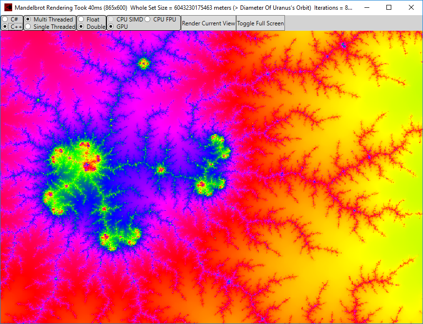

# MandelbrotCpuGpuBench
This is a Mandelbrot zoomer that can use C++, Parallel C++, C++ AMP, C#, Parallel C#, and C# AVX/SSE to calculate the set.

Rather than working out everything from scratch, some code from around the internet was studied and modifed:

The C++ code is based on an article by Marc Gregoire here https://www.codeguru.com/cpp/g-m/article.php/c19871/Mandelbrot-Using-C-AMP.htm

The C# code is based on a Microsoft example here https://github.com/Microsoft/dotnet-samples/tree/master/System.Numerics/SIMD/Mandelbrot

The tool lets you select between C# and C++ calculators, Multi-Thread and Single-Thread, 32 bit or 64 bit precision, and CPU SIMD or GPU or just plain CPU FPU code.

Zooming is done with the mouse wheel, and full screen can be toggled in a context menu or by double clicking the image. So you can real time zoom into the set using just the mouse wheel. On a Geforce GTX 1080 the speed is incredible.

The screen visual is generated using the C# WPF (Windows Presentation Framework) and a custom ImageSource.

Here's a screenshot showing how the GPU can render the set in 27ms when zoomed in to a level where the whole set would be the bigger than the orbit of Uranus:

